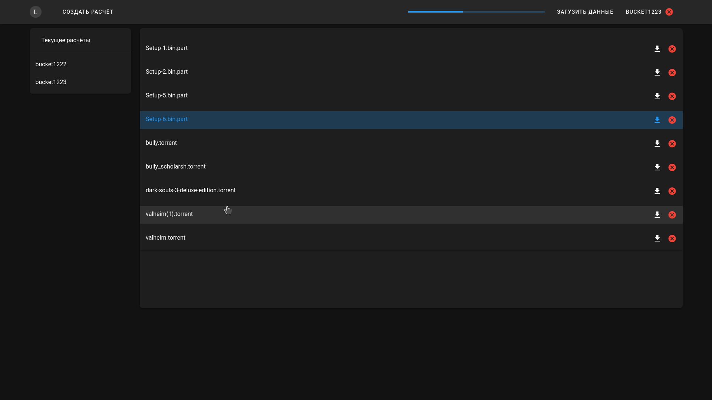

# [Текущий вид в самом конце](#текущий-вид)
# Что сделано?

- ## [Частичный перевод на русский язык](#частичный-перевод-на-русский-язык)
- ## [Разбиение приложения на компоненты](#разбиение-приложения-на-компоненты)
- ## [Тёмная тема](#тёмная-тема)

---

# Что делается?

- ## [Продолжаю раскидывать](#разбиение-приложения-на-компоненты)
- ## [Внесение правок в интерфейс](#внесение-правок-в-интерфейс)
- ## [Проработка архитектуры фронта](#проработка-архитектуры-фронта)

----

## Частичный перевод на русский язык

Перевод на текущий момент только частичный, потому что полная русификация пока не возможна. Имена расчётов передаются в адресной строке, а там русских символов не завезли. Это решается при помощи базы данных и использовании post запросов вместо get. Но пока в post запросах смысла нет, потому что minio api выдаёт ссылку на загрузку объекта по его имени и названию бакета (а русские символы в адресной строке не поддерживаются), поэтому пока нет бд - нет и полной русификации

-------

## Разбиение приложения на компоненты

Поддерживать код в монолитном состоянии - тот ещё ад. Разбиение на файлы необходимо. Но тут очень много нюансов с передачей информации между компонентами, потому что тут тоже применимы парадигмы ООП со всеми вытекающими. Раскидывать на компоненты пока получается довольно долго, не очень проработал архитектуру взаимодействия.

---

## Тёмная тема

Очень часто пишу ночью и я задолбался ловить флешку в лицо при переключении на светлый интерфейс приложухи

----

## Внесение правок в интерфейс

- ### Отображение объектов
- - Отображение пока не очень, перевожу в вид таблицы

- ### Панель информации об объекте
- - Отображение информации об объекте под его названием выглядит, мягко говоря, не очень, поэтому хочу сделать боковую панель с отображением этой самой информации. Появляться будет при нажатии на объекта

---

## Проработка архитектуры фронта

Проработка той самой архитектуры, в соответствии с которой есть и будет организовано взаимодействие между компонентами vue

---
## Текущий вид
