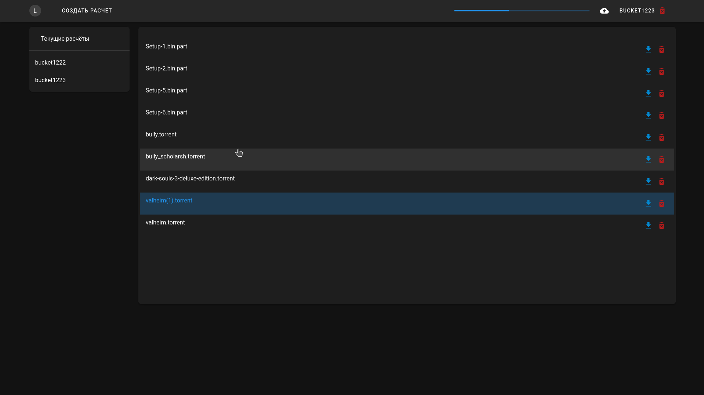

# [Текущий вид в самом конце](#текущий-вид)
# [Что сделано?](#что-сделано)

- ## [Частичный перевод на русский язык](#частичный-перевод-на-русский-язык)
- ## [Разбиение приложения на компоненты](#разбиение-приложения-на-компоненты)
- ## [Тёмная тема](#тёмная-тема)

---

# [Что делается?](#что-делается)

- ## [Продолжаю раскидывать](#разбиение-приложения-на-компоненты)
- ## [Внесение правок в интерфейс](#внесение-правок-в-интерфейс)
- ## [Проработка архитектуры фронта](#проработка-архитектуры-фронта)

----
# [Замечания и наблюдения](#замечания-и-наблюдения)

- ## [Русская локаль](#русская-локаль)
- ## [Переработка функции загрузки](#переработка-функции-загрузки)

---

# Что сделано

## Частичный перевод на русский язык

Перевод на текущий момент только частичный, потому что полная русификация пока не возможна. Имена расчётов передаются в адресной строке, а там русских символов не завезли. Это решается при помощи базы данных и использовании post запросов вместо get. Но пока в post запросах смысла нет, потому что minio api выдаёт ссылку на загрузку объекта по его имени и названию бакета (а русские символы в адресной строке не поддерживаются), поэтому пока нет бд - нет и полной русификации

-------

## Разбиение приложения на компоненты

Поддерживать код в монолитном состоянии - тот ещё ад. Разбиение на файлы необходимо. Но тут очень много нюансов с передачей информации между компонентами, потому что тут тоже применимы парадигмы ООП со всеми вытекающими. Раскидывать на компоненты пока получается довольно долго, не очень проработал архитектуру взаимодействия.

---

## Тёмная тема

Очень часто пишу ночью и я задолбался ловить флешку в лицо при переключении на светлый интерфейс приложухи

----
# Что делается

## Внесение правок в интерфейс

- ### Отображение объектов
- - Отображение пока не очень, перевожу в вид таблицы

- ### Панель информации об объекте
- - Отображение информации об объекте под его названием выглядит, мягко говоря, не очень, поэтому хочу сделать боковую панель с отображением этой самой информации. Появляться будет при нажатии на объекта

---

## Проработка архитектуры фронта

Проработка той самой архитектуры, в соответствии с которой есть и будет организовано взаимодействие между компонентами vue

---

# Замечания и наблюдения

- ## Русская локаль
- - На текущий момент что бакеты, что файлы не могут иметь некоторые символы (в том числе и русский язык) в названии. Это связано с тем, что их имена передаются в адресной строке при запросе. Возможное решение - замена всех имён (и бакетов, и объектов) на виртуальные. Виртуальное имя на русском языке, реальное - хэш. Если с бакетами и так понятно, что это необходимо, то с файлами возникает вопрос чрезмерного усложнения маршрута [Выбор файлов -> получение ссылки на их загрузку -> загрузка файлов по ссылке] -> [Выбор файлов -> передача имён файлов на сервер -> создание хэша имени -> объявление в базе данных соответствия имя=хэш -> получение ссылки на загрузку файлов -> передача на фронт ссылки на загрузку -> загрузка файла]. В дальнейшем при обращении либо к конкретному файлу для его скачивания, изменения, либо ко всем файлам в бакете, требуется прослойка на бэке, где будет происходить сопоставление имени файла с хэшем, обращение к серверу minio с хэшем имени

- ## Переработка функции загрузки
- - Переработать функцию загрузки файлов. Есть подозрение, что работает не оптимально
---

## Текущий вид
